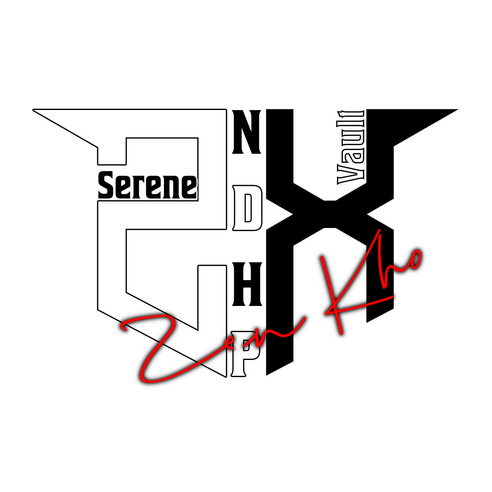

<p align="center">
  

  <h1 align="center">ZKCard</h1>
  <em>Thư viện Node.js tạo thẻ card đẹp, tối ưu cho ứng dụng âm nhạc và media.</em>
</p>

## 📝 Tổng quan

ZKCard là một thư viện nhỏ gọn cho Node.js giúp bạn tạo các thẻ (card) PNG tùy chỉnh — hỗ trợ trích xuất màu tự động từ thumbnail, nhiều font quốc tế, thanh tiến trình có animation và 18+ theme background đa dạng.

## 📚 Mục lục

- [🚀 Bắt đầu nhanh (Quickstart)](#-bắt-đầu-nhanh-quickstart)
- [✨ Tính năng](#-tính-năng)
- [📦 Project index](#-project-index)
- [🗂️ Cấu trúc dự án](#-cấu-trúc-dự-án)
- [⚡ Ví dụ nhanh](#-ví-dụ-nhanh)
- [🔐 License](#-license)
- [🔁 Chuyển sang README (EN)](README_en.md)

## 🚀 Bắt đầu nhanh (Quickstart)

```bash
npm install zkcard
```

Ví dụ cơ bản:

```javascript
const { zkcard } = require('zkcard');

const card = new zkcard({
  name: 'Tên bài hát',
  author: 'Tên nghệ sĩ', 
  requester: 'Người yêu cầu',
  color: 'auto',
  theme: 'zk', // "zk" hoặc "themes2"
  brightness: 50
});

const buffer = await card.build();
require('fs').writeFileSync('card.png', buffer);
```

## ✨ Tính năng

- ✨ Tạo card PNG tùy chỉnh với design đẹp mắt
- 🎨 Tự động trích xuất màu chủ đạo từ thumbnail (`auto`)
- 🌈 Hỗ trợ màu hex và điều chỉnh độ sáng tùy chỉnh
- ️ Hỗ trợ thumbnail từ URL hoặc buffer
- 🔤 Hỗ trợ nhiều font quốc tế (JP / KR / Emoji)
- 🎯 18+ theme background ngẫu nhiên đa dạng (zk & themes2)
- 🌈 Hiệu ứng màu sắc ngẫu nhiên cho text và border
- 📏 Tự động cắt text dài để tối ưu hiển thị

## 📦 Project index

- Package: `zkcard` — API chính để tạo card
- Build: `build/` — bản dựng (index.js, index.d.ts)
- Functions: `functions/` — helper (colorFetch, adjustBrightness, rgbToHex, getAvailableThemes)
- Structures: `structures/` — layout, fonts, themes và sample images
  - fonts/ — Font quốc tế (CircularStd, NotoSans, NotoEmoji)
  - images/ — Avatar mặc định, logo và 18+ theme backgrounds
    - zk/ — 8 ảnh background cho zk
    - themes2/ — 10 ảnh background cho theme2

## 🗂️ Cấu trúc dự án

```
zkcard/
├── LICENSE — Giấy phép MIT
├── package.json — Metadata & dependencies
├── README.md — Tài liệu tiếng Việt
├── README_en.md — Tài liệu tiếng Anh
└── build/ — Bản dựng phát hành
    ├── index.js — Entry point chính
    ├── index.d.ts — TypeScript definitions
    ├── functions/ — Hàm hỗ trợ
    │   ├── adjustBrightness.js — Điều chỉnh độ sáng
    │   ├── colorFetch.js — Trích xuất màu từ ảnh
    │   ├── getAvailableThemes.js — Lấy danh sách themes
    │   └── rgbToHex.js — Chuyển đổi RGB sang Hex
    └── structures/ — Tài nguyên card
        ├── zkcard.js — Logic tạo card chính  
        ├── fonts/ — Font quốc tế
        │   ├── circularstd-black.otf
        │   ├── notoemoji-bold.ttf
        │   ├── notosans-black.ttf
        │   ├── notosans-jp-black.ttf
        │   └── notosans-kr-black.ttf
        └── images/ — Hình ảnh templates
            ├── avatar.png — Avatar mặc định
            ├── logo.png — Logo ZKCard
            ├── zk/ — Bộ theme 1 (8 backgrounds)
            └── themes2/ — Bộ theme 2 (10 backgrounds)
```

## ⚡ Ví dụ nhanh

### Ví dụ cơ bản với method chaining

```javascript
(async () => {
  const { zkcard } = require('zkcard');
  const fs = require('fs');

  const card = new zkcard()
    .setName("Ash Again") // Tên bài hát
    .setAuthor("Gawr Gura") // Tên nghệ sĩ
    .setRequester("ZenKho") // Người yêu cầu
    .setColor("auto") // Tự động lấy màu từ thumbnail
    .setTheme("zk") // Theme khả dụng: "zk" hoặc "themes2"
    .setBrightness(50) // Độ sáng (0-255)
    .setThumbnail("https://your-image-url.com/cover.jpg")

  const cardBuffer = await card.build();
  fs.writeFileSync(`zkcard.png`, cardBuffer);
  console.log("Tạo card thành công!")
})()
```

### Ví dụ với constructor options

```javascript
(async () => {
  const { zkcard } = require('zkcard');
  const fs = require('fs');

  const card = new zkcard({
    name: "Beautiful Song",
    author: "Amazing Artist", 
    requester: "Music Lover",
    color: "#ff6b6b", // Màu hex tùy chỉnh (hoặc 'auto' để tự động)
    theme: "themes2",  // Theme card (zk hoặc themes2)
    brightness: 75,   // Độ sáng (0-255)
    thumbnail: "https://your-image-url.com/cover.jpg",
  });

  const cardBuffer = await card.build();
  fs.writeFileSync(`custom_card.png`, cardBuffer);
})()
```

### Kiểm tra themes khả dụng

```javascript
const { zkcard, getAvailableThemes } = require('zkcard');

// Lấy danh sách tất cả themes có sẵn
const availableThemes = getAvailableThemes();
console.log('Themes khả dụng:', availableThemes); // ['zk', 'themes2']

// Sử dụng theme ngẫu nhiên
const randomTheme = availableThemes[Math.floor(Math.random() * availableThemes.length)];
const card = new zkcard()
  .setName("Random Theme Song")
  .setAuthor("Artist")
  .setRequester("User")
  .setTheme(randomTheme)
  .setColor("#ff6b6b");
```

### Các tùy chọn thiết lập

| Method | Mô tả | Giá trị mặc định | Lưu ý |
|--------|-------|------------------|-------|
| `setName(string)` | Tên bài hát | **Required** | Tự động cắt nếu >15 ký tự |
| `setAuthor(string)` | Tên nghệ sĩ | **Required** | Tự động cắt nếu >15 ký tự |
| `setRequester(string)` | Người yêu cầu phát nhạc | **Required** | Tự động cắt nếu >35 ký tự |
| `setColor(string)` | Màu theme (`auto` hoặc hex) | `#ff0000` | `auto` sẽ lấy từ thumbnail |
| `setTheme(string)` | Theme card | `zk` | `zk` hoặc `themes2` |
| `setBrightness(number)` | Độ sáng (0-255) | `0` | Chỉ áp dụng khi color=`auto` |
| `setThumbnail(string)` | URL thumbnail | Avatar mặc định | Hỗ trợ URL và data URI |

### Tính năng nổi bật v1.5.8

- 🎨 **18+ Background Themes**: Tự động chọn ngẫu nhiên từ zk/ (8 ảnh) và themes2/ (10 ảnh)
- 🌈 **Random Color System**: 
  - Tên bài hát: 6 màu được phép (#000000, #FF0000, #FFFFFF, #800080, #000080, #2F4F4F)
  - Thumbnail border: Màu trắng
- 📏 **Smart Text Truncation**: Tự động cắt text dài và thêm "..." 
- 🖼️ **Enhanced Visual**: Rounded corners, gradient effects và professional layout
- 🎯 **Simplified API**: Loại bỏ progress bar để tập trung vào tính năng cốt lõi

## 🔐 License

Dự án này được cấp phép theo MIT — xem file `LICENSE` để biết chi tiết.

## 🔁 Chuyển đổi ngôn ngữ

Muốn xem README bằng tiếng Anh? Mở [README_en.md](README_en.md).

---

**Tác giả:** ZenKho-chill — https://github.com/ZenKho-chill