# 🎨 ZKCard Theme Preview Gallery

> **Tổng cộng: 28 themes** | ✅ **Thành công: 28** | ❌ **Thất bại: 0**

Đây là bộ sưu tập preview cho tất cả 28 themes có sẵn trong ZKCard v1.6.0.

## 📊 Thống kê

- **Character Themes**: 6/6 themes
- **Abstract Themes**: 20/20 themes  
- **Special Themes**: 2/2 themes

---

## 👥 Character Themes

Các themes được lấy cảm hứng từ anime characters và virtual personalities.

### <a id="bebe"></a>🎭 bebe

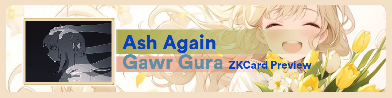
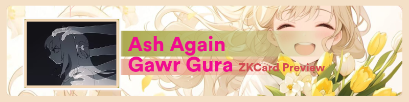

**Mô tả**: Theme bebe với auto color extraction và custom color (#ff6b6b)

---

### <a id="cute"></a>🎭 cute

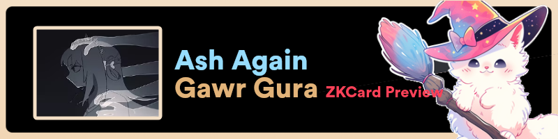
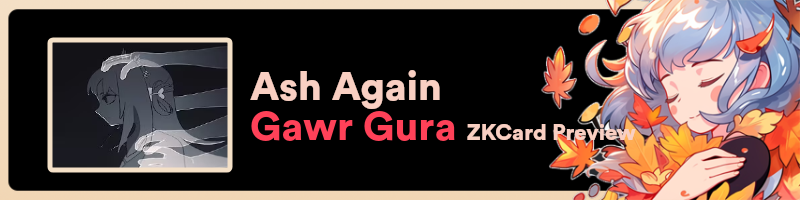

**Mô tả**: Theme cute với auto color extraction và custom color (#ff6b6b)

---

### <a id="kobokanaeru"></a>🎭 kobokanaeru

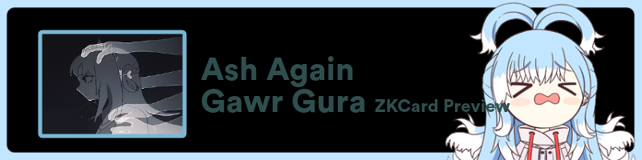
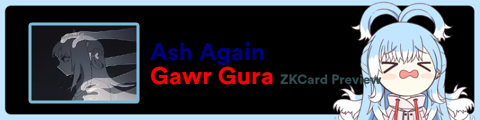

**Mô tả**: Theme kobokanaeru với auto color extraction và custom color (#ff6b6b)

---

### <a id="miko"></a>🎭 miko


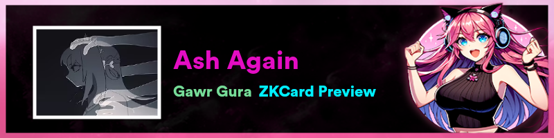

**Mô tả**: Theme miko với auto color extraction và custom color (#ff6b6b)

---

### <a id="vestiazeta"></a>🎭 vestiazeta

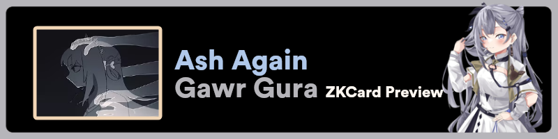
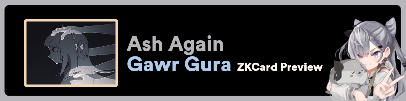

**Mô tả**: Theme vestiazeta với auto color extraction và custom color (#ff6b6b)

---

### <a id="yui"></a>🎭 yui

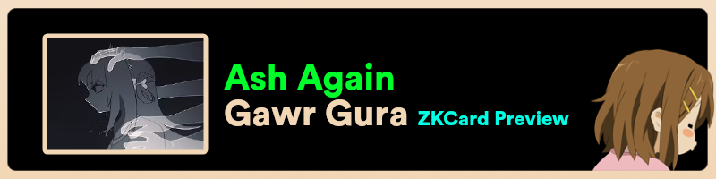


**Mô tả**: Theme yui với auto color extraction và custom color (#ff6b6b)

---

## 🌈 Abstract Themes

Các themes với design trừu tượng và nghệ thuật hiện đại.

### <a id="themes1"></a>🎨 themes1

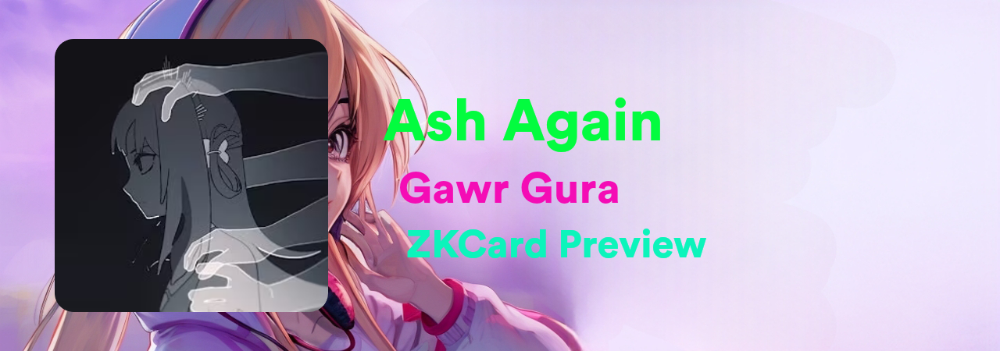
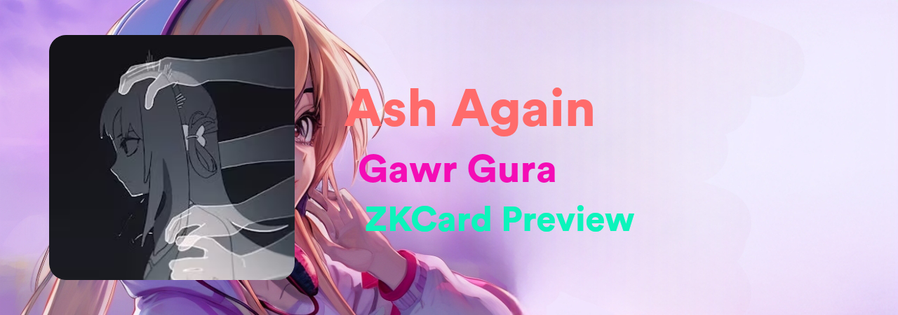

**Mô tả**: Abstract theme themes1 với color variations

---

### <a id="themes10"></a>🎨 themes10


**Mô tả**: Abstract theme themes10 với color variations

---

### <a id="themes11"></a>🎨 themes11


**Mô tả**: Abstract theme themes11 với color variations

---

### <a id="themes12"></a>🎨 themes12

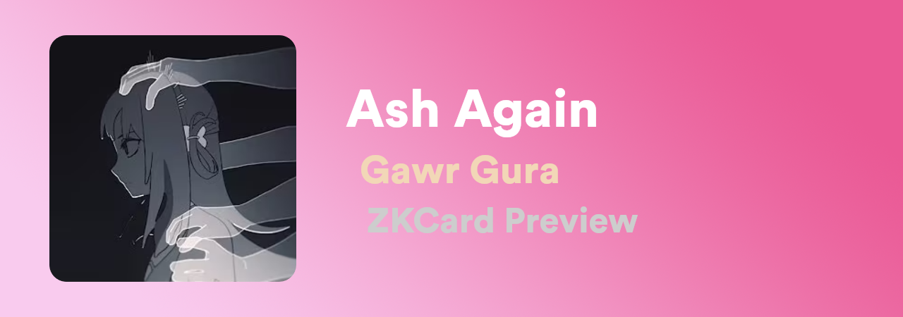


**Mô tả**: Abstract theme themes12 với color variations

---

### <a id="themes13"></a>🎨 themes13


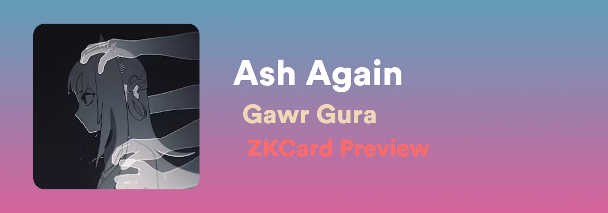

**Mô tả**: Abstract theme themes13 với color variations

---

### <a id="themes14"></a>🎨 themes14

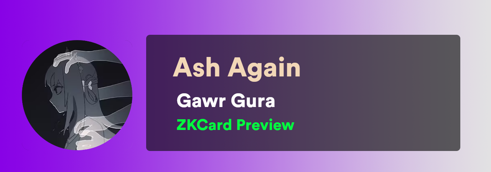


**Mô tả**: Abstract theme themes14 với color variations

---

### <a id="themes15"></a>🎨 themes15


**Mô tả**: Abstract theme themes15 với color variations

---

### <a id="themes16"></a>🎨 themes16


**Mô tả**: Abstract theme themes16 với color variations

---

### <a id="themes17"></a>🎨 themes17


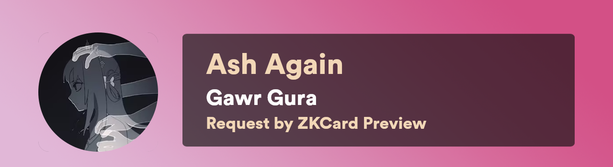

**Mô tả**: Abstract theme themes17 với color variations

---

### <a id="themes18"></a>🎨 themes18

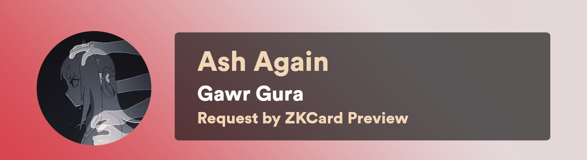


**Mô tả**: Abstract theme themes18 với color variations

---

### <a id="themes19"></a>🎨 themes19


**Mô tả**: Abstract theme themes19 với color variations

---

### <a id="themes2"></a>🎨 themes2


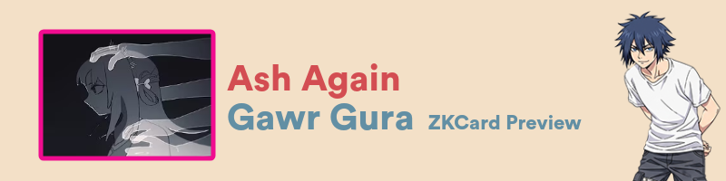

**Mô tả**: Abstract theme themes2 với color variations

---

### <a id="themes20"></a>🎨 themes20

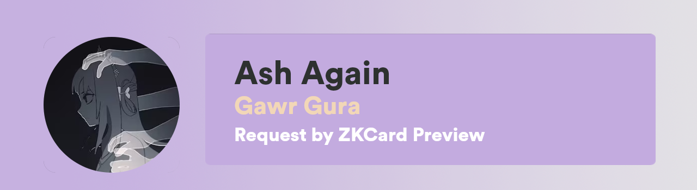


**Mô tả**: Abstract theme themes20 với color variations

---

### <a id="themes3"></a>🎨 themes3


**Mô tả**: Abstract theme themes3 với color variations

---

### <a id="themes4"></a>🎨 themes4


**Mô tả**: Abstract theme themes4 với color variations

---

### <a id="themes5"></a>🎨 themes5

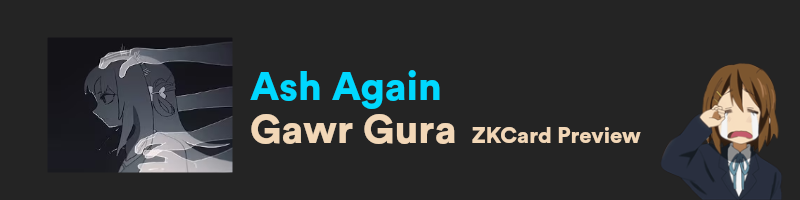
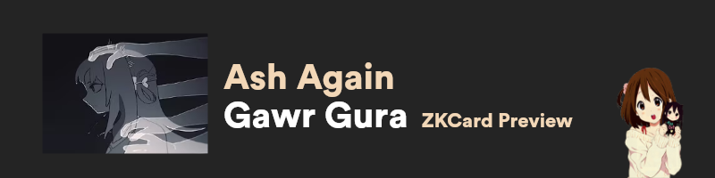

**Mô tả**: Abstract theme themes5 với color variations

---

### <a id="themes6"></a>🎨 themes6


**Mô tả**: Abstract theme themes6 với color variations

---

### <a id="themes7"></a>🎨 themes7


**Mô tả**: Abstract theme themes7 với color variations

---

### <a id="themes8"></a>🎨 themes8

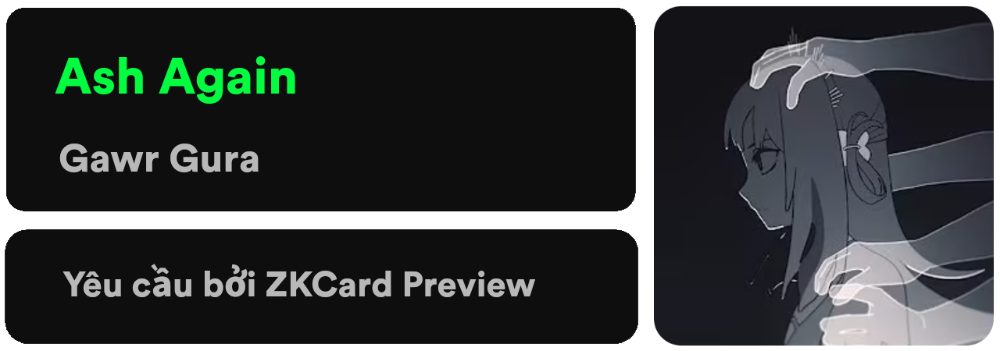
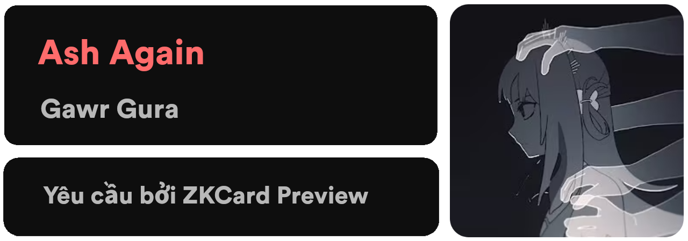

**Mô tả**: Abstract theme themes8 với color variations

---

### <a id="themes9"></a>🎨 themes9


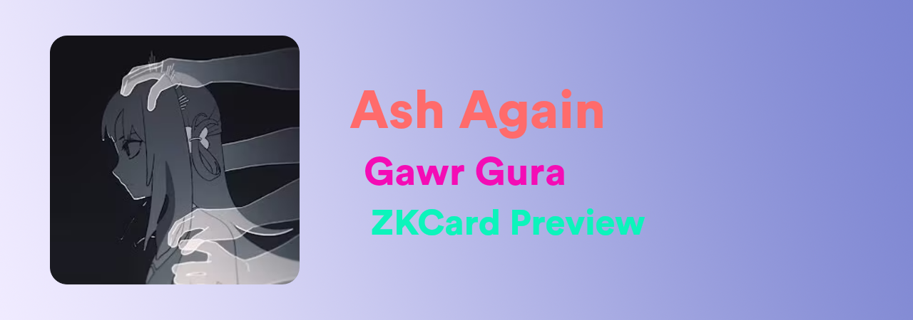

**Mô tả**: Abstract theme themes9 với color variations

---

## ⭐ Special Themes

Các themes đặc biệt với tính năng và design độc đáo.

### <a id="blank"></a>✨ blank


**Mô tả**: Minimal design với canvas 800x200, hoàn hảo cho simple cards

---

### <a id="zk"></a>✨ zk


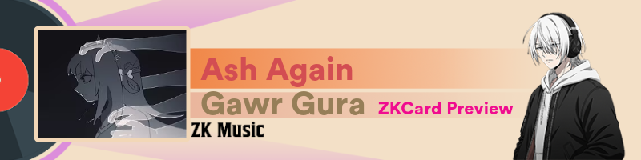

**Mô tả**: Original ZK theme với 8 classic backgrounds

---

## 🔧 Sử dụng Theme

```javascript
const { zkcard } = require('zkcard');

// Sử dụng theme bất kỳ
const card = new zkcard({
  name: 'Song Name',
  author: 'Artist Name',
  requester: 'User Name',
  theme: 'miko', // Thay bằng theme mong muốn
  color: 'auto', // hoặc hex color như '#ff6b6b'
  brightness: 80
});

const buffer = await card.build();
require('fs').writeFileSync('output.png', buffer);
```

## 📝 Ghi chú

- **Auto Color**: Tự động trích xuất màu từ thumbnail
- **Custom Color**: Sử dụng màu hex #ff6b6b
- **Sample Data**: 
  - Song: "Ash Again"
  - Artist: "Gawr Gura"  
  - Requester: "ZKCard Preview"
  - Thumbnail: Gawr Gura official thumbnail

---

**Tạo bởi ZKCard v1.5.9** | [GitHub Repository](https://github.com/ZenKho-chill/zkcard)

*Tạo lúc: 12:46:23 23/8/2025*
